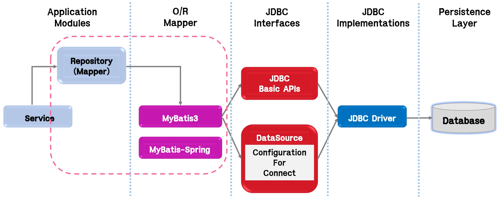
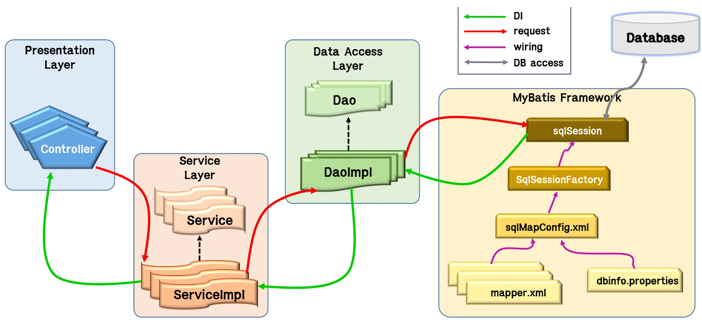
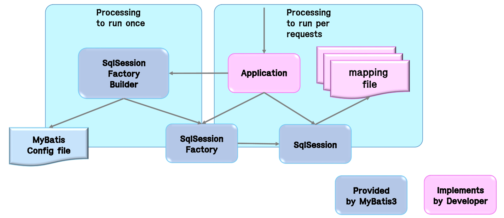
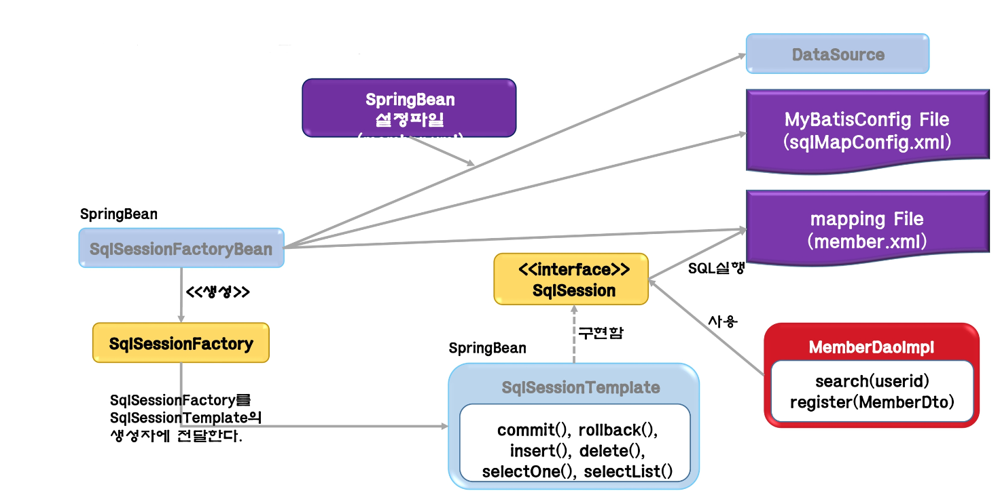
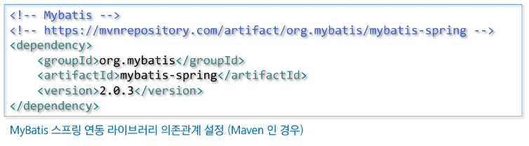
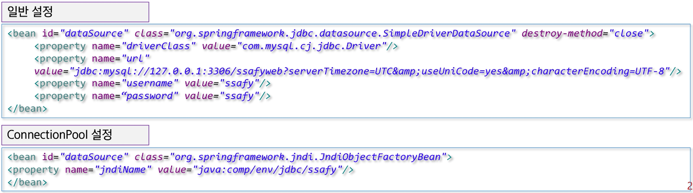

## MyBatis

### MyBatis

##### MyBatis 개요

- MyBatis는 Java Object와 SQL문 사이의 자동 Mapping 기능을 지원하는 ORM Framework
  - MyBatis는 SQL을 별도의 파일로 분리해서 관리
  - Object-SQL 사이의 parameter mapping 작업을 자동으로 해 줌
  - MyBatis는 Hibernate나 JPA(Java Persistence API)처럼 새로운 DB 프로그래밍 패러다임을 익혀야 하는 부담이 없이, 개발자가 익숙한 SQL을 그대로 이용하면서 JDBC 코드 작성의 불편함을 제거해 주고, 도메인 객체나 VO 객체를 중심으로 개발이 가능

##### MyBatis 특징

- 쉬운 접근성과 코드의 간결함
  - 가장 간단한 persistence framework
  - XML형태로 서술된 JDBC코드라 생각해도 될 만큼 JDBC의 모든 기능을 MyBatis가 대부분 제공
  - 복잡한 JDBC 코드를 걷어내며 깔끔한 소스코드를 유지
  - 수동적인 parameter 설정과 Query 결과에 대한 mapping 구문을 제거
- SQL문과 프로그래밍 코드의 분리
  - SQL에 변경이 있을 때마다 자바 코드를 슈정하거나 컴파일 하지 않아도 됨
  - SQL 작성과 관리 또는 검토를 DBA와 같은 개발자가 아닌 다른 사람에게 맡길 수 있음
- 다양한 프로그래밍 언어로 구현가능
  - JAVA, C#, .NET, Ruby, ...

### MyBatis-Spring

##### MyBatis와 MyBatis-Spring의 주요 Component

- MyBatis와 MyBatis-Spring을 사용한 DB Access Architecture

 

- MyBatis를 사용하는 Data Access Layer

 

- MyBatis 3의 주요 Component

 

- MyBatis 3의 주요 Component의 역할

  - MyBatis 설정파일 (sqlMapperConfig.xml)
    - 데이터베이스의 접속 주소 정보나 객체의 alias, Mapping 파일의 경로 등의 고정된 환경 정보를 설정
  - SqlSessionFactoryBuilder
    - MyBatis 설정 파일을 바탕으로 SqlSessionFactory를 생성
  - SqlSessionFactory
    - SqlSession을 생성
  - SqlSession
    - 핵심적인 역할을 하는 Class로 SQL 실행이나 Transaction 관리를 실행
    - SqlSession 오브젝트는 Tread-Safe 하지 않으므로 thread마다 필요에 따라 생성
  - mapping 파일(member.xml)
    - SQL 문과 ORMapping을 설정

- MyBatis-Spring의 주요 Component

 

- MyBatis-Spring의 주요 Component의 역할
  - MyBatis 설정파일 (sqlMapConfig.xml)
    - Dto 객체의 정보를 설정한다(Alias)
  - SqlSessionFactoryBean
    - MyBatis 설정 파일을 바탕으로 SqlSessionFactory를 생성
    - Spring Bean으로 등록해야 함
  - SqlSessionTemplate
    - 핵심적인 역할을 하는 클래스로서 SQL 실행이나 Transaction 관리를 실행
    - SqlSession interface를 구현하며, Thread-safe하다
    - Spring Bean으로 등록해야 함
  - mapping 파일 (member.mxl)
    - SQL문과 ORMapping을 설정
  - Spring Bean 설정파일(beans.xml)
    - SqlSessionFactoryBean을 Bean에 등록할 때 DataSource 정보와 MyBatis Config 파일 정보, Mapping 파일의 정보를 함께 설정함
    - SqlSessionTemplate을 Bean으로 등록

### MyBatis Interface

##### MyBatis3의 Mapper Interface

- Mapper Interface

  - Mapper Interface는 mapping 파일에 기재된 SQL을 호출하기 위한 interface
    - Mapper Interface는 SQL을 호출하는 프로그램을 Type Safe하게 기술하기 위해 MyBatis 3.x부터 등장
    - Mapping 파일에 있는 SQL을 java interface를 통해 호출할 수 있도록 해 줌

- Mapper Interface를 사용하지 않았을 경우

  - SQL을 호출하는 프로그램은 SqlSession의 method의 argument에 문자열로 namespace + "." + SQL ID로 지정
  - 문자열로 지정하기 때문에 오타에 의한 버그가 생기거나, IDE에서 제공하는 code assist를 사용할 수 없음

- Mapper Interface를 사용했을 경우
  - UserMapper Interface는 개발자가 작성
  - '**packagename+ "." + InterfaceName + "." + methodName**' 이 'namespace + "." + SQL ID' 가 되도록
  - NameSpace 속성에는 package를 포함한 Mapper Interface의 이름을 작성
  - SQL ID에는 mapping하는 method의 이름을 지정

### MyBatis-Spring 연동

##### 개요

- MyBatis를 Standalone 형태로 사용하는 경우, SqlSessionFactory 객체를 직접 사용
- 스프링을 사용하는 경우, 스프링 컨테이너에 MyBatis 관련 빈을 등록하여 MyBatis를 사용
- 또한 스프링에서 제공하는 트랜잭션 기능 사용하면 손쉽게 트랜잭션 처리
- MyBatis를 스프링과 연동하기 위해서는 MyBatis에서 제공하는 Spring 연동 라이브러리가 필요

 

##### DataSource 설정

- 스프링을 사용하는 경우, 스프링에서 데이터 소스를 관리하므로 MyBatis 설정 파일에서는 일부 설정을 생략
- 스프링 환경 설정파일(application-context.xml)에 데이터 소스를 설정
- 데이터 소스는 dataSource 아이디를 가진 빈으로 데이터베이스 연결정보를 가진 객체
- MyBatis와 스프링을 연동하면 데이터베이스 설정과 트랜잭션 처리는 스프링에서 관리

 
