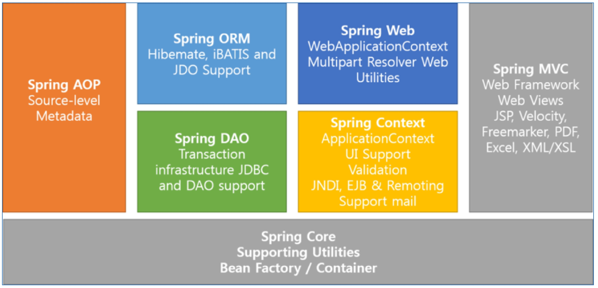

## Spring Framework

### Spring Framework 등장 배경

##### 과거엔 EJB를 사용하여 어플리케이션 작성

- 하이 레벨 로직을 자동으로 처리해주어서 어플리케이션 작성을 쉽게 할 수 있음
- 로우 레벨의 트랙잭션이나 상태관리, 멀티 쓰레딩, 리소스 풀링과 같은 복잡한 Low Level의 API를 이해하지 못하더라도 아무 문제 없이 어플리케이션을 개발할 수 있다.

##### EJB.. 현실에서 반영하기 어려움

- 코드 수정 후 반영하는 과정 자체가 거창해 기능은 좋지만 복잡한 스펙으로 인한 개발의 효율성이 떨어짐
- 어플리케이션을 테스트하기 위해서는 반드시 EJB서버가 필요함

##### 웹사이트가 점점 커지면서 엔터프라이즈급의 서비스가 필요하게 되었다

- 세션빈에서 트랜잭션 관리가 용이함
- 로그인, 분산처리, 보안 등
- EJB 없이도 엔터프라이즈 어플리케이션을 개발하는 방법이 등장한다.
  - AOP나 DI같은 새로운 프로그래밍 방법론으로 가능
  - POJO로 전언적인 프로그래밍 모델이 가능해 짐

##### 점차 POJO + 경량 프레임워크를 사용하기 시작

- POJO (Plain Old Java Object)
  - 특정 프레임워크나 기술에 의존적이지 않은 자바 객체
  - 특정 기술에 종속적이지 않기 때문에 생산성, 이식성 향상
  - Plain : component interface를 상속받지 않는 특징
  - Old : EJB 이전의 java class를 의미
- 경량 프레임 워크
  - EJB가 제공하는 서비스를 지원해 줄 수 있는 프레임워크 등장
  - Hibernate(JPA), JDO, IBatis(MyBatis), Spring

##### POJO + Framework

- EJB 서버와 같은 거창한 컨테이너가 필요 없음
- 오픈소스 프레임워크라 사용이 무료
- 각종 기업용 어플리케이션 개발에 필요한 상당히 많은 라이브러리가 지원
- 스프링 프레임워크는 모든 플랫폼에서 사용이 가능함
- 스프링은 웹 분야 뿐만이 아니라 어플리케이션 등 모든 분야에 적용이 가능한 다양한 라이브러리를 가지고 있다.

### Spring Framework

##### Spring Framework?

- 엔터프라이즈 급 어플리케이션을 만들기 위한 모든 기능을 종합적으로 제공하는 경량화 된 솔루션
- JEE가 제공하는 다수의 기능을 지원하고 있기 때문에, JEE를 대체하는 프레임워크로 자리잡고 있다
- DI나 AOP와 같은 기능도 지원
- Spring Framework는 자바로 엔터프라이즈 어플리케이션을 만들 때 포괄적으로 사용하는 프로그래밍 및 Configuration Model을 제공해 주는 Framework로 어플리케이션 수준의 인프라 스트럭쳐를 제공
- 즉, 개발자가 복잡하고 실수하기 쉬운 low level에 신경 쓰지 않고 Business Logic 개발에 전념할 수 있도록 해준다

### Spring Framework의 구조

##### Spring 삼각형

 
엔터프라이즈 어플리케이션 개발 시 복잡함을 해결하는 스프링의 핵심

1. **POJO**(Plain Old Java Object)
   - 특정 환경이나 기술에 종속적이지 않은 객체지향 원리에 충실한 자바 객체
   - 테스트하기 용이하며, 객체지향 설계를 자유롭게 적용할 수 있다
2. **PSA**(Portable Service Abstraction)
   - 환경과 세부기술의 변경과 관계없이 일관된 방식으로 기술에 접근할 수 있게 해주는 설계 원칙
   - 트랜잭션 추상화, OXM 추상화, 데이터 엑세스의 Exception 변환기능.. 등 기술적인 복잡함은 추상화를 통해 low level의 기술 구현 부분과 기술을 사용하는 인터페이스로 분리
   - 예를 들어 데이터베이스에 관계없이 동일하게 적용 할 수 있는 트랜잭션 처리방식
3. **IoC/DI**
   - DI 는 유연하게 확장 가능한 객체를 만들어 두고 객체 간의 의존관계는 외부에서 다이나믹하게 설정
4. **AOP**(Aspect Oriented Programming)
   - 관심사의 분리를 통해서 소프트웨어의 모듈성을 향상
   - 공통 모듈을 여러 코드에 쉽게 적용가능

### Spring Framework의 특징

##### 경량 컨테이너

- 스프링은 자바객체를 담고 있는 컨테이너이다
- 스프링 컨테이너는 이들 자바 객체의 생성과 소멸과 같은 라이플 사이클을 관리
- 언제든지 스프링 컨테이너로부터 필요한 객체를 가져와 사용할 수 있다

##### DI(Dependency Injection - 의존성 지원) 패턴 지원

- 스프링은 설정 파일이나, 어노테이션을 통해서 객체 간의 의존 관계를 설정할 수 있다.
- 따라서, 객체는 의존하고 있는 객체를 직접 생성하거나 검색할 필요가 없다

##### AOP(Aspect Oriented Programming - 관점 지향 프로그래밍) 지원

- AOP는 **문제를 바라보는 관점을 기준**으로 프로그래밍하는 기법
- 이는 문제를 해결하기 위한 핵심관심 사항과 전체에 적용되는 공통관심 사항을 기준으로 프로그래밍 함으로서 공통 모듈을 여러 코드에 쉽게 적용할 수 있도록 함
- 스프링은 자체적으로 프록시 기반의 AOP를 지원하므로 트랜잭션이나, 로깅, 보안과 같이 여러 모듈에서 공통으로 필요로 하지만 **실제 모듈의 핵심이 아닌 기능**들을 **분리하여 각 모듈에 적용**이 가능하다

##### POJO(Plain Old Java Object) 지원

- **특정 인터페이스를 구현하거나 또는 클래스를 상속하지 않는** 일반 자바 객체 지원
- 스프링 컨테이너에 저장되는 자바객체는 특정한 인터페이스를 구현하거나, 클래스 상속 없이도 사용이 가능하다.
- 일반적인 자바 객체를 칭하기 위한 별칭 개념

##### IoC(Inversion of Control - 제어의 반전) 지원

- IoC는 **스프링이 갖고 있는 핵심적인 기능**
- 자바의 객체 생성 및 의존관계에 있어 모든 제어권은 개발자에게 있었음
- 서블릿과 EJB가 나타나면서 기존의 제어권이 서블릿 컨테이너 및 EJB 컨테이너에게 넘어갔다
- 단, 모든 객체의 제어권이 넘어간 것은 아니고 서블릿, EJB에 대한 제어권을 제외한 나머지 객체 제어권은 개발자들이 담당
- 스프링에서도 객체에 대한 생성과 생명주기를 관리할 수 있는 기능을 제공하고 있는데 이런 이유로 **스프링 컨테이너** 또는 **IoC 컨테이너**라고 부르기도 한다

##### 스프링은 트랜잭션 처리를 위한 일관된 방법을 제공

- JDBC, JTA 또는 컨테이너가 제공하는 트랜잭션을 사용하든, **설정파일을 통해 트랜잭션 관련정보를 입력**하기 때문에 **트랜잭션 구현에 상관 없이 동일한 코드를 여러 환경에서 사용 가능**

##### 스프링은 영속성과 관련된 다양한 API를 지원

- **JDBC를 비롯하여 iBatis, MyBatis, Hibernate, JPA** 등 DB처리를 위해 널리 사용되는 라이브러리와 연동 지원

##### 스프링은 다양한 API에 대한 연동을 지원

- 스프링은 JMS, 메일, 스케쥴링 등 엔터프라이즈 어플리케이션 개발에 필요한 다양한 API를 **설정 파일과 어노테이션**을 통해서 손쉽게 사용할 수 있도록 지원

#### Spring Framework Module

 

##### 프레임 워크는 레고다

- 코어와 bean Factory를 밑바탕으로
- AOP, ORM, DAO 등등 필요한 것들을 레고 블럭처럼 쌓아서 사용

### IoC & Container

#### IoC(Inversion of Control, 제어의 역행)

- IoC/DI
- 객체 지향 언어에서 Object간의 연결 관계를 런타임에 결정
- 객체 간의 관계가 느슨하게 연결됨
- IoC의 구현 방법 중 하나가 DI

##### IoC 유형

 

##### DI(Dependency Injection, 의존성 주입)

> A라는 클래스와 B라는 클래스가 있을 때, A라는 클래스가 B에 있는 메소드를 써야할 때, A는 B에 의존적이고 B가 없으면 A는 동작할 수 없다. 의존성 주입은 B라는 객체를 미리 만들어서 A에 넣어주는 식이고, 이러한 B객체를 만들어 주는 컨테이너가 스프링 컨테이너이다.

- Object에 lookup 코드를 사용하지 않고 컨테이너가 직접 의존 구조를 Object에 설정 할 수 있도록 지정해 주는 방식
- Object가 컨테이너의 존재 여부를 알 필요가 없음
- Lookup 관련된 코드들이 Object내에서 사라짐
- Setter Injection과 Constructor Inject
  - setter
  - constructor
    - 생성자를 이용하는 것이 권장 사항
  - method

##### DL(Dependency Lookup, 의존성 검색)

- 컨테이너가 lookup context를 통해서 필요한 Resource나 Ojbect를 얻는 방식
- JNDI 이외의 방법을 사용한다면 JNDL 관련 코드를 오브젝트 내에서 일일히 변경해 주어야 함
- Lookup 한 Object를 필요한 타입으로 Casting 해 주어야 함
- Naming Exception을 처리하기 위한 로직이 필요
- 사용 방법
  - JNDI Lookup
    - MVC Connection Pooling 에서 사용

##### 객체간 강한 결합

- 클래스 호출 방식
- 클래스내에 선언과 구현이 모두 되어있기 때문에 다양한 형태로 변화가 불가능

- 객체간의 강향 결합을 다형성을 통해 낮춤
- 객체간의 강한 결합을 Factory를 통해 결합도를 낮춤
- 객체 간의 강한 결합을 Assembler를 통해 결합도를 낮춤
  - Assembler == Spring

#### Container

- 객체의 생성, 사용, 소멸에 해당하는 라이프사이클을 담당
- 라이프사이클을 기본으로 어플리케이션 사용에 필요한 주요 기능을 제공

##### 기능

- 라이플 사이클 관리
- Depnedency 객체 제공
- 스레드 관리
- 기타 어플리케이션 실행에 필요한 환경

##### 필요성

- 비즈니스 로직 외에 부가적인 기능들에 대해서는 독립적으로 관리되도록 하기 위함
- 서비스 lookup 이나 Configuration에 대한 일관성을 갖기 위함
- 서비스 객체를 사용하기 위해 각각 Factory 또는 Singleton 패턴을 직접 구현하지 않아도 됨

##### IoC Container

- 오브젝트의 생성과 관계설정, 사용, 제거 등의 작업을 어플리케이션 코드 대신 독립된 컨테이너가 담당
- **컨테이너가 코드 대신 오브젝트에 대한 제어권을 갖고 있어서** IoC라고 부름
- 이런 이유로, 스프링 컨테이너를 IoC 컨테이너라고 부르기도 함
- **스프링에서 IoC를 담당**하는 컨테이너에는 **BeanFactory, ApplicationContext**가 있음

##### Spring DI Container

- Spring DI Container가 관리 하는 객체를 빈(Bean)이라 하고, 이 빈들의 생명주기를 관리하는 것을 빈팩토리(BeanFactory)라 한다.
- BeanFactory에 여러 가지 컨테이너 기능을 추가한 것을 ApplicationContext라 함

##### BeanFactory

- Bean을 등록, 생성, 조회, 반환 관리
- 일반적으로 BeanFactory보다는 이를 확장한 ApplicationContext를 사용
- getBean() method가 정의되어 있음

#####

### Spring 프로젝트 생성

- 인코딩 설정 확인
- Spring Legacy Project
  - MVC
    - pom.xml 수정
    - maven update

root-context.xml

- 모델 관련

servlet-context.xml

- 컨트롤러, 뷰리졸버 등등

aop로 예외처리 가능

- @ControllerAdvice
  - @ExceptionHandler

### REST API

##### OPEN API(Application Programming Interface)

- OPEN API는 프로그래밍에서 사용할 수 있는 개방되어 있는 상태의 인터페이스
- NAVER, KAKAO 등 포털 서비스 사이트나 통계청, 기상청, 우체국 등과 같은 관공서, 공공 데이터 포털이 가지고 있는 데이터를 외부 응용 프로그램에서 사용할 수 있도록 OPEN API를 제공하고 있다.
- OPEN API와 함께 거론되는 기술이 REST이며, 대부분의 OPEN API는 REST방식으로 지원

##### REST(Representational State Transfer)

- 2000년도 로이 필딩의 박사학위 논문에 최초로 소개
- REST는 하나의 URI는 하나의 고유한 리소스를 대표하도록 설계된다는 개념에 전송방식을 결합해서 원하는 작업을 지정한다.
- URI + GET/POST/PUT/DELETE
- 웹의 장점을 최대한 활용할 수 있는 아키텍쳐로써 REST를 발표
- HTTP URI를 통해 제어할 자원을 명시하고, HTTP Method(GET,POST,PUT,DELETE)를 통해 해당 자원을 제어하는 명령을 내리는 방식의 아키텍쳐

##### REST 구성

- **자원**(Resource) - URI
- **행위**(Verb) - HTTP Method
- **표현**(Representation)
  > 잘 표현된 HTTP URI로 리소스를 정의하고 HTTP method로 리소스에 대한 행위를 정의한다. 리소스는 JSON, XML과 같은 여러가지 언어로 표현할 수 있다.

##### 기존 Service와 REST Service

- 기존 서비스 : 요청에 대한 처리를 한 후 가공된 데이터를 이용하여 특정 플랫폼에 적합한 형태로 View로 만들어서 반환
- REST 서비스
  - 데이터만 처리하거나, 처리 후 반환될 데이터가 있다면, JSON이나 XML 형식으로 전달
  - View에 대해서는 신경 쓸 필요가 없다
  - 이러한 이유로 Open API에서 자주 사용

 

##### REST

- 기존의 전송방식과 달리 서버는 요청으로 받은 리소스에 대해 순수한 데이터를 전송한다
- 기존의 GET/POST 외에 PUT, DELETE 방식을 사용하여 리소스에 대한 CRUD 처리를 할 수 있다.
- **HTTP URI**를 통해 제어할 **자원(Resource)을 명시**하고, **HTTP Method**를 통해 해당 **자원을 제어하는 명령**을 내리는 방식의 Architecture이다
- 자원을 표현할 때 Collection(문서, 객체의 집합)과 Document(하나의 문서, 객체) 사용
  - `aaa.com/sports/baseball/players/31`
  - sport**s**, player**s**
- 가장 큰 단점은 딱 정해진 표준이 없어 '다들 이렇게 쓰더라~~' 정도의 암묵적인 표준만 정해져 있다
  - 하이픈은 사용가능하지만 언더바는 사용하지 않는다(가독성)
  - 특별한 경우를 제외하고 대문자 사용은 하지 않는다(대소문자 구분, RFC3986)
  - URI 마지막에 슬래시를 사용하지 않는다
  - 슬래시(/)로 계층 관계를 나타낸다
  - 확장자가 포함된 파일이름을 직접 포함시키지 않는다
  - URI는 명사를 사용한다

##### 기존의 웹 접근 방식과 REST API 방식의 차이점

| 작업           |      | 기존방식                          |            | REST 방식        | 비고   |
| -------------- | ---- | --------------------------------- | ---------- | ---------------- | ------ |
| Create(Insert) | POST | /write.do?id=troment              | POST       | /blog/troment    | 글쓰기 |
| Read(Select)   | GET  | /write.do?id=troment&articleno=25 | GET        | /blog/troment/25 | 글읽기 |
| Update(Update) | POST | /write.do?id=troment              | **PUT**    | /blog/troment    | 글수정 |
| Delete(Delete) | POST | /write.do?id=troment&articleno=25 | **DELETE** | /blog/troment/25 | 글삭제 |

- 기존의 블로그등은 GET과 POST만으로 자원에 대한 CRUD를 처리하며, URI는 액션을 나타냈다
- REST로 변경할 경우 4가지 method를 모두 사용하여 CRUD를 처리하며, URI는 제어하려는 자원을 나타낸다

##### REST API 설정

- Jackson library
  - **jackson-databind** 라이브러리는 객체를 **JSON 포맷**의 문자열로 반환시켜서 브라우저로 전송한다
  - **jackson-dataformat-xml** 라이브러리는 객체를 **xml**로 브라우저로 전송한다
  - pom.xml에 libarary 추가!

##### REST 관련 Annotation

- @RestController
  - Controller가 REST 방식을 처리하기 위한 것임을 명시
- @ResponseBody
  - JSP 같은 뷰로 전달되는 것이 아니라 데이터 자체를 전달
- @PathVariable
  - URL 경로에 있는 값을 파라미터로 추출
- @CrossOrigin
  - Ajax의 크로스 도메인 문제를 해결
- @ReqeustBody
  - JSON 데이터를 원하는 타입으로 바인딩

### SpringBoot

##### SpringBoot의 특징

- Spring의 경우 어플리케이션을 개발하려면 사전에 많은 작업을 해야했다
- SpringBoot의 장점
  - 프로젝트에 따라 자주 사용되는 라이브러리들이 미리 조합되어 있다
  - 복잡한 설정을 자동으로 처리
  - 내장 서버를 포함해서 톰캣과 같은 WAS를 추가로 설치하지 않아도 개발 가능
  - WAS에 배포하지 않고도 실행할 수 있는 JAR 파일로 Web Application을 개발 할 수 있다

##### 프로젝트 생성 구조 및 주요 구성 폴더/파일

- src/main/java
  - java source directory
- HelloSpringBootApplication.java
  - application을 시작할 수 있는 main method가 존재하는 스프링 구성 메인 클래스
- static
  - css, js, img, html 등 정적 resource directory
- templates
  - SpringBoot에서 사용가능한 여러가지 View Template 위치
- application.properties
  - application 및 스프링의 설정 등에서 사요할 여러 가지 property를 정의한 file
- src/main
  - jsp등의 리소드 directory
