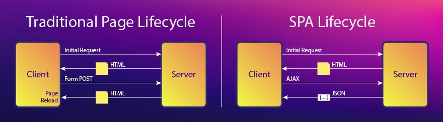
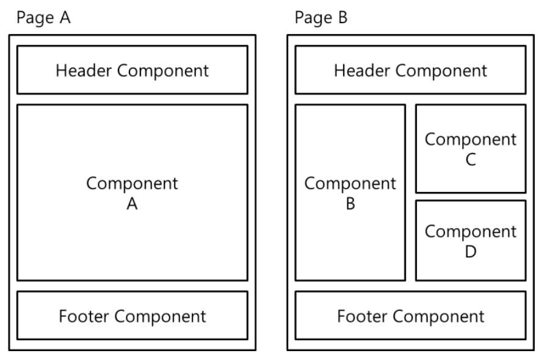

# SPA 간단 개념

<aside>
💡 SPA가 어떤 느낌인지 10분만 투자해서 읽어 봅시다.

</aside>

## SPA(Single Page Application)

### 기존의 웹 방식

 

전통적인 웹 방식은 **새로운 페이지를 요청할 때마다 정적 리소스가 다운로드 되고 전체 페이지를 다시 렌더링**하는 방식을 사용하므로 **새로고침이 발생되어 사용성이 좋지 않으며, 변경이 필요없는 부분을 포함하여 전체 페이지를 갱신하므로 비효율적**이다.

 이러한 페이지 갱신 과정에서도 서버측에서 HTML 파일을 만들어서 넘겨주기 때문에 기존의 웹 브라우저는 단지 보여주기만 할 뿐, **요청한 웹 문서에 대한 처리는 전부 서버가 담당**했다. 

 과거에는 웹에서 제공되는 정보가 그렇게 많지 않았고, 많다고 해도 페이지가 나뉘어져 있었기 때문에 데이터를 쪼개서 보여줄 수 가 있었다. 하지만 요즘은 성능도 좋아지고 기술도 발전하는 등 다양한 이유로 **하나의 페이지에서 보여줄 수 있는 정보가 점점 많아졌다**. 게다가 **사용자 또한 증가**하여 서버 측에서는 **사용자 각각에 대한 페이지를 만들어야 하니 과부하가 걸렸다**. 

위와 같은 문제점들을 해결하기 위해 SPA가 등장하게 되었다. 

### SPA란?

 말 그대로, **한 개의 페이지로 이루어진 어플리케이션**이다. 즉 서버로부터 완전한 새로운 페이지를 불러오지 않고 **현재의 페이지를 동적으로 다시 작성**함으로써 사용자와 소통하는 웹 어플리케이션이나 웹 사이트를 말한다. 

**[기존 페이징 방식과 SPA의 라이프 사이클 비교]**

> **렌더링을 어떻게 프론트에서 담당할 수 있을까?**
> 

 **우리는 자바스크립트라는 DOM을 건드릴 수 있는 스크립트 언어를 알고 있다**(알고 있어야 한다). 단 하나의 html 파일만 가지고, 안의 내용물들은 전부 js 파일로 DOM을 조작하여 채울 수 있기 때문에  서버에서 데이터만 받아온다면 JS를 통해 페이지를 동적으로 렌더링하는 것이 가능하다.

> **그러면 서버에서 데이터는 어떻게 가져와?**
> 

 여기서 사용하는 기술이 대체적으로 **REST API**이다. 자바스크립트로 REST API를 사용하여 서버측과 데이터를 주고 받을 수 있다.

- [REST API 참고 자료](https://meetup.nhncloud.com/posts/92)
    

### SPA 특징

- **라우팅(Routing)**
    - 라우팅이란 출발지에서 목적지까지의 경로를 결정하는 기능이다.
    - 애플리케이션의 라우팅은 사용자가 태스크를 수행하기 위해 어떤 화면(view)에서 다른 화면으로 화면을 전환하는 내비게이션을 관리하기 위한 기능을 의미한다.
    - 일반적으로 라우팅은 **사용자가 요청한 URI 또는 이벤트를 해석하고 새로운 페이지로 전환하기 위해 필요한 데이터를 서버에 요청하고 페이지를 전환하는 위한 일련의 행위**를 말한다.
    - 브라우저가 화면을 전환하는 경우는 다음과 같다.
        1. 브라우저의 주소창에 URL을 입력하면 해당 페이지로 이동한다.
        2. 웹페이지의 링크(a 태그)를 클릭하면 해당 페이지로 이동한다.
        3. 브라우저의 뒤로가기 또는 앞으로가기 버튼을 클릭하면 사용자 방문 기록(history)의 뒤 또는 앞으로 이동한다.
    - 결론 : **SPA는 이러한 라우팅을 서버가 아닌 프론트엔드 측에서 구현하는 것이 핵심.**
- **컴포넌트(Component) 구조**
    - 페이지를 구성할 때 컴포넌트들이 모여 하나의 페이지를 만든다.
    - 데이터 또한 특정 부분에만 바인딩하여 데이터 변경 소요가 발생할 때 바인딩 되어 있는 부분만 변경 된다.
    - 이렇듯 **컴포넌트만 변경이 되기 때문에 페이지 이동이 생기지 않는다**.
    - 레고 블럭을 생각하면 이해하기 쉬울 수도 있다. **필요한 부분만 바꿔서 다른 블럭으로 바꿔주는 느낌**이다.
- **그림을 통한 구조 이해**
    
    
    
    - 위 사진을 보면, A와 B로 페이지가 나눠져 있어서 다른 페이지 처럼 보일 수 있지만 실제로는 **컴포넌트만 재배치** 된 것이다. **이처럼 SPA는 라우팅에 따라 다양하게 컴포넌트가 구성된다.**

### SPA 장단점

| 장점 | 단점 |
| --- | --- |
| 단일 페이지로 구성되며 기존의 SSR(서버 사이드 렌더링) 방식과 비교할 때, 배포가 간단하다. | 모든 정적 리소스를 최초에 한 번 다운로드 하기 때문에 초기 구동 속도가 상대적으로 느리다. |
| 웹 어플리케이션에 필요한 모든 정적 리소스를 한 번만 다운로드 한다. | SPA는 CSR(클라이언트 사이드 렌더링)이기 때문에 검색엔진 최적화 이슈가 있다. |
| 데이터만 주고 받기 때문에 전체적인 트래픽이 감소 된다. |  |
| 새로고침이 발생하지 않는다. |  |