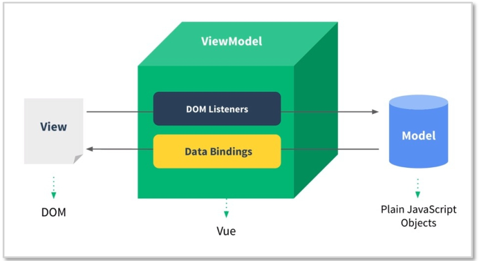

# Vue.js

## 목차

1. [Vue.js](###Vue.js)
2. [Vue Instance & Vue Instance LifeCycle]()
3. Template
   1. 보간법(Interpolation)(#)
   2. 디렉티브(Directive)

### Vue.js

##### 개요

- Evan You에 의해서 만들어짐
- Vue 탄생은 Google에서 Angular로 개발하다가 가벼운 걸 만들어 보고 싶은 생각으로 시작한 **개인 프로젝트**
- 사용자 인터페이스를 만들기 위해 사용하는 오픈소스 Progressive Framework

##### 특징

- 접근성 (Approachable)
- 유연성 (Versatile)
- 고성능 (Performant)

##### MVVM Pattern

 

- Model + View + ViewModel
- Mdoel
  - 순수 자바스크립트 객체
- View
  - 웹 페이지의 POM
- ViewModel
  - Vue의 역할
- 기존에는 자바스크립트로 view에 해당하는 DOM에 접근하거나 수정하기 위해 jQuery와 같은 library 이용
- Vue는 view와 Model을 연결하고 자동으로 바인딩하므로 양방향 통신을 가능하게 함

##### Vue.js 3.x

- 22년 3월 출시
- 컴포지션 API 출시