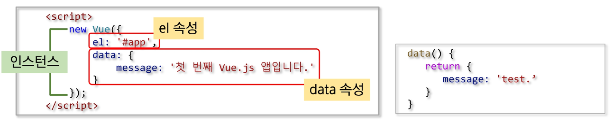

### Vue Instance

##### Vue Instance 생성

 

- el
  - Vue가 적용될 요소 지정
  - CSS Selector or HTML Element
- data
  - Vue에서 사용되는 **정보 저장**
  - **객체** 또는 **함수**의 형태
- template
  - 화면에 표시할 HTML, CSS 등의 마크업 요소를 정의하는 속성
  - 마우스 클릭 이벤트 처리와 같이 화면의 전반적인 이벤트와 화면 동작과 관련된 로직을 추가
- created
  - 뷰 인스턴스가 생성되자 마자 실행할 로직 정의

##### Vue Instance의 유효범위

- Vue Instance를 생성하면 HTML의 특정 범위 안에서만 옵션 속성들이 적용
- el 속성과 밀접한 관계가 있다
- 유효 범위 예시
  - Vue()로 인스턴스가 생성
    - el 속성에 지정한 화면 요소에 인스턴스가 부착
      - data 속성이 el 속성에 지정한 요소와 그 이하 레벨의 요소에 적용

### Vue Instance Life Cycle

##### Vue Instance Life Cycle

- Life Cycle은 크게 나누면 생성, 부착, 갱신, 소멸 총 4단계
- 속성
  - beforeCreate
    - Vue Instance가 생성되고 각 정보의 설정 전에 호출
    - DOM과 같은 화면 요소에 접근 불가
  - created
    - Vue Instance가 생성된 후 데이터들의 설정이 완료된 후 호출
    - Instance가 화면에 부착하기 전이기 때문에 template 속성에 정의된 DOM 요소는 접근 불가
    - 서버에 데이터를 요청하여 받아오는 로직을 수행하기 좋다
  - beforeMount
    - 마운트가 시작되기 전에 호출
  - mounted
    - 지정된 element에 Vue Instance 데이터가 마운트 된 후에 호출
    - template 속성에 정의한 화면 요소에 접근할 수 있어 화면 요소를 제어하는 로직 수행
  - beforeUpdate
    - 데이터가 변경될 때 virtual DOM이 렌더링, 패치 되기 전에 호출
  - updated
    - Vue에서 관리하는 데이터가 변경되어 DOM이 업데이트 된 상태
    - 데이터 변경 후 화면 요소 제어와 관련된 로직을 추가
  - beforeDestroy
    - Vue Instance가 제거되기 전에 호출
  - destroyed
    - Vue Instance가 제거된 후에 호출