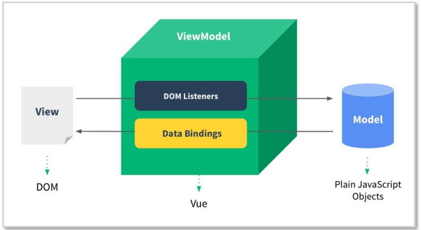
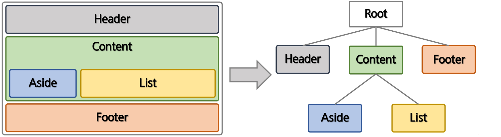
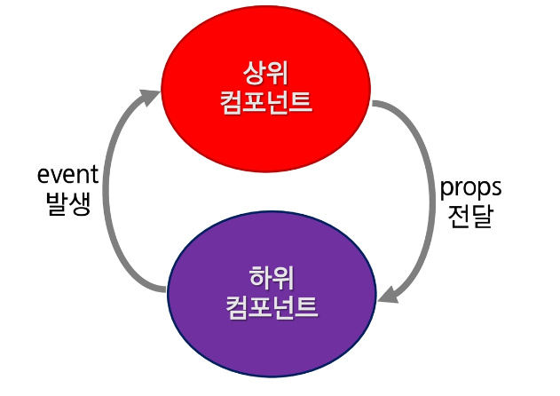

## Vue.js

### Vue.js

##### 개요

- Evan You에 의해서 만들어짐
- Vue 탄생은 Google에서 Angular로 개발하다가 가벼운 걸 만들어 보고 싶은 생각으로 시작한 **개인 프로젝트**
- 사용자 인터페이스를 만들기 위해 사용하는 오픈소스 Progressive Framework

##### 특징

- 접근성 (Approachable)
- 유연성 (Versatile)
- 고성능 (Performant)

##### MVVM Pattern

<br>

- Model + View + ViewModel
- Mdoel
  - 순수 자바스크립트 객체
- View
  - 웹 페이지의 POM
- ViewModel
  - Vue의 역할
- 기존에는 자바스크립트로 view에 해당하는 DOM에 접근하거나 수정하기 위해 jQuery와 같은 library 이용
- Vue는 view와 Model을 연결하고 자동으로 바인딩하므로 양방향 통신을 가능하게 함

##### Vue.js 3.x

- 22년 3월 출시
- 컴포지션 API 출시

#### Vue Instance

##### Vue Instance 생성

<br>

- el
  - Vue가 적용될 요소 지정
  - CSS Selector or HTML Element
- data
  - Vue에서 사용되는 **정보 저장**
  - **객체** 또는 **함수**의 형태
- template
  - 화면에 표시할 HTML, CSS 등의 마크업 요소를 정의하는 속성
  - 마우스 클릭 이벤트 처리와 같이 화면의 전반적인 이벤트와 화면 동작과 관련된 로직을 추가
- created
  - 뷰 인스턴스가 생성되자 마자 실행할 로직 정의

##### Vue Instance의 유효범위

- Vue Instance를 생성하면 HTML의 특정 범위 안에서만 옵션 속성들이 적용
- el 속성과 밀접한 관계가 있다
- 유효 범위 예시
  - Vue()로 인스턴스가 생성
    - el 속성에 지정한 화면 요소에 인스턴스가 부착
      - data 속성이 el 속성에 지정한 요소와 그 이하 레벨의 요소에 적용

##### Vue Instance Life Cycle

- Life Cycle은 크게 나누면 생성, 부착, 갱신, 소멸 총 4단계
- 속성
  - beforeCreate
    - Vue Instance가 생성되고 각 정보의 설정 전에 호출
    - DOM과 같은 화면 요소에 접근 불가
  - created
    - Vue Instance가 생성된 후 데이터들의 설정이 완료된 후 호출
    - Instance가 화면에 부착하기 전이기 때문에 template 속성에 정의된 DOM 요소는 접근 불가
    - 서버에 데이터를 요청하여 받아오는 로직을 수행하기 좋다
  - beforeMount
    - 마운트가 시작되기 전에 호출
  - mounted
    - 지정된 element에 Vue Instance 데이터가 마운트 된 후에 호출
    - template 속성에 정의한 화면 요소에 접근할 수 있어 화면 요소를 제어하는 로직 수행
  - beforeUpdate
    - 데이터가 변경될 때 virtual DOM이 렌더링, 패치 되기 전에 호출
  - updated
    - Vue에서 관리하는 데이터가 변경되어 DOM이 업데이트 된 상태
    - 데이터 변경 후 화면 요소 제어와 관련된 로직을 추가
  - beforeDestroy
    - Vue Instance가 제거되기 전에 호출
  - destroyed
    - Vue Instance가 제거된 후에 호출

#### 보간법(Interpolation)

##### 문자열

- 데이터 바인딩의 가장 기본 형태는 "Mustache(콧수염)" 구문(이중 중괄호)을 사용한 텍스트 보간
  - `{{속성명}}`
- v-once 디렉티브를 사용하여 데이터 변경 시 업데이트 되지 않는 일회성 보간을 수행

```html
<span>메세지 : {{ msg }}</span>

<span v-once> 다시는 변경하지 않습니다 : {{ msg }}</span>
```

##### 원시 HTML

- 이중 중괄호는 HTML이 아닌 일반 텍스트로 데이터를 해석
- 실제 HTML을 출력하려면 v-html 디렉티브를 사용

```html
<p>Using mustaches: {{rawHtml}}</p>

<p>Using v-html directive: <span v-html="rawHtml"></span></p>
```

##### JavaScript 표현식 사용

- Vue.js는 모든 데이터 바인딩 내에서 JavaScript 표현식의 모든 기능을 지원

```html
{{ number + 1 }} {{ ok ? 'YES' : 'NO'}} {{ message.split('').reverse().join('') }}

<div v-bind:id="'list-' + id"></div>
```

- 한 가지 제한사항은 각 바인딩에 하나의 단일 표현식만 포함될 수 있으므로 아래처럼 작성하면 안됨

```html
<!-- 아래는 구문입니다, 표현식이 아닙니다. -->
{{ var a = 1}}
<!-- 조건문은 작동하지 않습니다. 삼항 연산자를 사용해야 합니다. -->
{{ if (ok) {return message } }}
```

### directive

### Vue Instance 속성

##### Vue Method

- Vue 객체는 생성과 관련된 data 및 method의 정의 기능
- method안에서 data를 "this.데이터이름"으로 접근 가능

```html
<div id="app">
  <div>data : {{message}}</div>
  <div>method kor : {{helloKor()}}</div>
  <div>method eng : {{helloEng()}}</div>
</div>
<script>
  new Vue({
    el: "#app",
    data: {
      message: "Hello",
      name: "최현인",
    },
    methods: {
      helloEng() {
        return "Hello " + this.name;
      },
      helloKor() {
        return "안녕 " + this.name;
      },
    },
  });

  let vm = new Vue({
    data: {
      count: 1,
    },
    methods: {
      incCount() {
        console.log("incCount 호출됨");
        this.count++;
      },
    },
  });
  vm.incCount();
  console.log(vm.count); // 2
</script>
```

##### Vue filter

- 뷰의 필터는 화면에 표시되는 텍스트의 형식을 쉽게 변환해주는 기능
  - ex) 1000000원 => 1,000,000원
- filter를 이용하여 표현식에 **새로운 결과** 형식을 적용
- 중괄호 보간법 **[{{}}]** 또는 **v-bind** 속성에서 사용이 가능

```html
<!-- 데이터 | 필터이름 -->
{{ message | capitalize }}
<!-- 체이닝 가능, | ... | ... | ... 이런식으로 -->

<div v-bind:id="rawId | formatId"></div>
```

- 전역 필터
  - Vue.filter('name', (val) =>{});

```html
<script>
  Vue.filter("count1", (val) => {
    if (val.length == 0) {
      return;
    }
    return `${val} : ${val.length}자`;
  });
</script>
```

- 지역 필터
- vue 객체의 filters 필드

```html
<div id="app">
  <div>
    <input type="text" v-model="msg" />
  </div>
  <div>
    <h2>결과 :</h2>
    <h3>{{ msg | count1 }}</h3>
    <h3>{{ msg | count2('문자를 넣어보세요') }}</h3>
  </div>
</div>

<script>
  new Vue({
    el: "#app",
    data: {
      msg: "",
    },
    filters: {
      count2(val, alternative) {
        if (val.length == 0) {
          return alternative;
        }
        return `${val} : ${val.length}자`;
      },
    },
  });
</script>
```

- 사용 예
- 금액 단위 표기, 전화번호 표기

```html
<div id="app">
  <div>
    금액 : <input type="text" v-model="msg1" /><br />
    전화번호 : <input type="text" v-model="msg2" />
  </div>
  <div>
    <h3>{{ msg1 | price }}</h3>
    <h3>{{ msg2 | mobile }}</h3>
  </div>
</div>
<script>
  // 금액 단위
  Vue.filter("price", (value) => {
    if (!value) return value;
    return value.toString().replace(/\B(?=(\d{3})+(?!\d))/g, ",");
  });
  // 전화 번호, 정규 표현식 공부하기, maxlength 활용하면 최대 글자 수 제한 가능
  Vue.filter("mobile", (value) => {
    if (!value || !(value.length === 10 || value.length === 11)) return value;
    return value.replace(/^(\d{3})(\d{3,4})(\d{4})/g, "$1-$2-$3");
  });
  new Vue({
    el: "#app",
    data: {
      msg1: "",
      msg2: "",
    },
  });
</script>
```

##### Vue computed 속성

- 특정 **데이터의 변경사항**을 **실시간으로 처리**
- 캐싱을 이용하여 데이터의 변경이 없을 경우 캐싱된 데이터를 반환 >> 값
- Setter와 Getter를 직접 지정할 수 있음
  - Getter는 기본으로 가지고 있음
- 작성은 method 형태로 작성하지만 Vue에서 **proxy 처리하여** **property 처럼** 사용
- 종속적인 데이터가 변경이 되었을 때 호출

##### Vue computed VS method 차이점

```html
<div id="app">
  <input type="text" v-model="message" />
  <p>원본 메시지: "{{ message }}"</p>
  <p>역순으로 표시한 메시지1: "{{ reversedMsg }}"</p>
  <p>역순으로 표시한 메시지2: "{{ reversedMsg }}"</p>
  <p>역순으로 표시한 메시지3: "{{ reversedMsg }}"</p>
</div>
<script>
  var vm = new Vue({
    el: "#app",
    data: {
      message: "안녕하세요 여러분",
    },
    computed: {
      reversedMsg: function () {
        console.log("꺼꾸로 찍기");
        return this.message.split("").reverse().join("");
      },
    },
  });
</script>
```

- Vue 인스턴스가 생성될 때 data의 message값을 받아 reversedMsg를 계산하여 저장해 놓는다. (캐싱)
- 위 코드에서 reversedMsg를 한 번 실행하는 것과 같다.

```html
<div id="app">
  <input type="text" v-model="message" />
  <p>원본 메시지: "{{ message }}"</p>
  <p>역순으로 표시한 메시지1: "{{ reversedMsg() }}"</p>
  <p>역순으로 표시한 메시지2: "{{ reversedMsg() }}"</p>
  <p>역순으로 표시한 메시지3: "{{ reversedMsg() }}"</p>
</div>
<script>
  var vm = new Vue({
    el: "#app",
    data: {
      message: "안녕하세요 싸피여러분",
    },
    methods: {
      reversedMsg: function () {
        console.log("꺼꾸로 찍기");
        return this.message.split("").reverse().join("");
      },
    },
  });
</script>
```

- method는 reversedMsg()를 사용하려고 할 때마다 계산한다
- 위 코드에서는 reversedMsg()를 세 번 실행하는 것과 같다.

##### Vue watch 속성

- Vue Instance의 특정 property가 변경될 때 실행할 콜백 함수 설정
- 디버깅할 때 사용

```html
<div id="app">
  <div>
    <input type="text" v-model="a" />
  </div>
</div>
<script>
  var vm = new Vue({
    el: "#app",
    data: {
      a: 1,
    },
    watch: {
      a: function (val, oldVal) {
        console.log("new: %s, old: %s", val, oldVal);
      },
    },
  });
  console.log(vm.a);
  vm.a = 2; // => new: 2, old: 1
  console.log(vm.a);
</script>
```

- Computed는 종속된 데이터가 변경되었을 경우 그 데이터를 다시 계산하여 캐싱한다
- Watch의 경우는 data가 변경되었을 경우 다른 data를 (변경하는) 작업을 한다

```html
<div id="app">
  <p>원본 메시지: "{{ message }}"</p>
  <p>역순으로 표시한 메시지: "{{ reversedMsg }}"</p>
  <input type="text" v-model="message" />
</div>
<script>
  const app = new Vue({
    el: "#app",
    data: {
      message: "Hello",
      reversedMsg: "",
    },
    watch: {
      message: function (newVal, oldVal) {
        console.log(newVal, oldVal);
        this.reversedMsg = newVal.split("").reverse().join("");
      },
    },
  });
</script>
```

### Vue Event

##### Vue event

- DOM Event를 청취하기 위해 **v-on** directive 사용
- inline event handling
- method를 이용한 event handling

##### Vue event 청취 : v-on

- v-on directive를 사용하여 DOM 이벤트를 듣고 트리거 될 때, javaScript를 실행 할 수 있다.

```html
<button v-on:click="counter+=1">클릭</button>
<!-- 생략 -->
new Vue({ el: '#app', data:{ counter:0, } })
```

##### method event handler

- 이벤트 발생시 처리 로직을 v-on에 넣기 힘들다
- v-on에서는 이벤트 발생시 처리해야 하는 method의 이름을 받아서 처리한다.

```html
<div id="app">
  <button v-on:click="greet">Greet</button>
</div>
<script>
  var vm = new Vue({
    el: "#app",
    data: {
      name: "SSAFY",
    },
    methods: {
      greet: function (event) {
        alert("Hello " + this.name + "!");
        console.dir(event.target);
      },
    },
  });

  // 또한 JavaScript를 이용해서 메소드를 호출할 수 있습니다.
  //vm.greet(); // => 'Hello Vue.js!'
</script>
```

##### Inline method handler

- 메소드 이름을 직접 바인딩 하는 대신 인라인 JavaScript 구문에 메소드를 사용할 수 도 있다.
- 원본 DOM 이벤트에 엑세스 해야 하는 경우 특별한 $event 변수를 사용해 메소드에 전달할 수도 있다.

```html
<div id="app">
  <form action="http://www.naver.com">
    <button v-on:click="greet1('SSAFY')">Greet</button>
    <button v-on:click="greet2($event, 'Ssafy')">Greet</button>
  </form>
</div>
<script>
  new Vue({
    el: "#app",
    methods: {
      greet1: function (msg) {
        alert("Hello " + msg + "!");
        console.dir(event.target);
      },
      greet2: function (e, msg) {
        if (e) e.preventDefault();
        alert("Hello " + msg + "!");
        console.dir(e.target);
      },
    },
  });
</script>
```

##### 이벤트 수식어 (Event Modifier)

- method는 DOM의 이벤트를 처리하는 것 보다 data 처리를 위한 로직만 작업하는 것이 좋음
- 이 문제를 해결하기 위해, Vue는 v-on 이벤트에 이벤트 수식어를 제공한다
- 수식어는 점으로 표시된 접미사이다.
  - .stop
  - .prevent

```html
<div id="app">
  <h2>페이지 이동</h2>

  <a href="test29.html" @click="sendMsg1">페이지 이동 막기1</a><br />
  <a href="test29.html" @click="sendMsg2">페이지 이동 막기2</a><br />
  <a href="test29.html" @click.prevent="sendMsg1">페이지 이동 막기3</a><br />
</div>
<script>
  new Vue({
    el: "#app",
    methods: {
      sendMsg1() {
        alert("이동할까요?");
      },
      sendMsg2(e) {
        e.preventDefault();
        alert("이동막기");
      },
    },
  });
</script>
```

##### 키 수식어(Key Modifier)

- Vue는 키 이벤트를 수신할 대 v-on에 대한 키 수식어를 추가할 수 있다.
- key code .
  - enter
  - tab
  - delete
  - esc
  - space
  - up
  - down
  - left
  - right

```html
<div id="app">
  아이디 :<br />
  <input placeholder="검색할 아이디를 입력하세요" v-model="id" @keyup="sendId" /><br />
  <input placeholder="검색할 아이디를 입력하세요" v-model="id" @keyup.enter="sendId" /><br />
  <input placeholder="검색할 아이디를 입력하세요" v-model="id" @keyup.13="sendId" /><br />
  <button @click.once="sendId">검색</button>
</div>
<script>
  new Vue({
    el: "#app",
    data: {
      id: "",
    },
    methods: {
      sendId() {
        alert(this.id);
      },
    },
  });
</script>
```

##### ref, $refs

- 뷰에서는 $refs 속성을 이용해 DOM에 접근할 수 있다
- 단, 뷰의 가장 중요한 목적 중 하나는 개발자가 DOM을 다루지 않게 하는 것이므로, 되도록 ref를 사용하는 것을 피하는 것이 좋다

```html
<style>
  .success {
    color: dodgerblue;
  }

  .fail {
    color: darkred;
  }
</style>
<!-- 생략 -->
<div id="app">
  <h2>엘리먼트 참조하기</h2>
  <!-- 아이디 : <input type="text" v-model="id"> -->
  아이디 : <input type="text" v-model="id" ref="id" @keyup="idCheck" />
  <button @click="idCheck">아이디 중복 체크</button>
  <div
    v-bind:class="{success : isSuccess, fail : isFail}"
    v-bind:style="myStyle"
    v-html="msg"
  ></div>
</div>
<script>
  new Vue({
    el: "#app",
    data: {
      id: "",
      msg: "",
      isSuccess: false,
      isFail: false,
      myStyle: {
        fontSize: "25px",
      },
    },
    methods: {
      idCheck() {
        if (this.id.length < 5 || this.id.length > 12) {
          this.msg = `아이디는 5자이상 12자리 이하입니다.`;
          this.$refs.id.focus();
          console.dir(this.$refs.id);
          this.isSuccess = false;
          this.isFail = false;
          return;
        } else {
          if (this.id === "ssafy") {
            this.msg = `<b>${this.id}</b>는 사용할 수 없습니다.`;
            this.isSuccess = false;
            this.isFail = true;
          } else {
            this.msg = `<b>${this.id}</b>는 사용할 수 있습니다.`;
            this.isSuccess = true;
            this.isFail = false;
          }
        }
        console.log(this.$refs.id.value);
      },
    },
  });
</script>
```

### CSS class binding

##### class binding

- element의 class와 style을 변경
- v-bind:class는 조건에 따라 class를 적용할 수 있다
- `v-bind:class="{active : true/false }"`
  - active라는 클래스를 적용 할 것인가

```html
<style>
  .active {
    background: rgb(106, 148, 238);
    color: white;
  }

  div {
    width: 200px;
    height: 200px;
    border: 1px solid #444;
  }
</style>

<div id="app">
  <div v-bind:class="{ active: isActive }">VueCSS적용</div>
  <button v-on:click="toggle">VueCSS</button>
</div>
<script type="text/javascript">
  new Vue({
    el: "#app",
    data: {
      isActive: false,
    },
    methods: {
      toggle: function () {
        this.isActive = !this.isActive;
      },
    },
  });
</script>
```

```html
<!-- 스타일 변경 예시 -->
<style type="text/css">
  .completed {
    text-decoration: line-through;
    font-style: italic;
  }
</style>
<div id="app">
  <ul>
    <li :class="{completed: todo.done}" :style="myStyle" v-for="todo, index in todos" :key="index">
      {{todo.msg}}
      <button @click="complete(todo)" class="btn">완료</button>
    </li>
  </ul>
</div>
<script>
  new Vue({
    el: "#app",
    data: {
      todos: [
        {
          msg: "5시간 잠자기",
          done: false,
        },
        {
          msg: "알고리즘 1시간 공부하기",
          done: false,
        },
        {
          msg: "Vue 1시간 공부하기",
          done: false,
        },
      ],
      //스타일 변경
      myStyle: {
        fontSize: "20px",
      },
    },
    methods: {
      complete: function (todo) {
        todo.msg = todo.msg + "완료";
        todo.done = !todo.done;
      },
    },
  });
</script>
```

### form input binding

##### 폼 입력 바인딩

- v-modle directive를 사용하여 폼 input과 textarea element에 양방향 데이터 바인딩을 생성할 수 있다
  - text와 textarea 태그는 value속성과 input이벤트를 사용한다
  - 체크박스들과 라디오 버튼들은 checked 속성과 change 이벤트를 사용한다
  - Select 태그는 value를 prop으로, change를 이벤트로 사용한다

##### form - text, textarea

- 문자열 (text)
- 여러줄을 가진 문장 (textarea)
  - 텍스트 영역의 보간은 작동하지 않는다
    - v-model을 사용

```html
<div id="app">
  <div>
    아이디 :
    <input v-model.trim="id" placeholder="아이디를 입력하세요" />
    <!-- v-model은 기본적으로 모든 key stroke가 발생할 때마다 값을 업데이트 시킨다.
           .lazy 수식어를 추가하여 change 이벤트 이후에 동기화 할 수 있습니다. -->
    <input v-model.lazy="id" placeholder="아이디를 입력하세요" />
  </div>
  <div>
    메세지 :
    <textarea v-model="message" placeholder="내용을 입력하세요"></textarea>
  </div>
  <p>{{ id }} 님에게 보내는 메세지 : {{ message }}</p>
</div>
<script>
  new Vue({
    el: "#app",
    data: {
      id: "",
      message: "",
    },
  });
</script>
```

##### form - checkbox

- 하나의 체크박스는 단일 boolean 값을 갖는다

```html
<div id="app">
  <div>
    <p>
      이메일 수신
      <input type="checkbox" id="emailYN" v-model="email" />
      <label for="emailYN">{{ email }}</label>
    </p>
  </div>
  <div>
    <p>
      SMS 수신
      <input type="checkbox" id="smsYN" v-model="sms" true-value="Y" false-value="N" />
      <label for="smsYN">{{ sms }}</label>
    </p>
  </div>
</div>
<script>
  new Vue({
    el: "#app",
    data: {
      email: false,
      sms: "Y",
    },
  });
</script>
```

- 여러 개의 체크박스는 같은 배열을 바인딩 할 수 있다
- 배열의 값과 checkbox의 value 속성이 같을 경우 체크 처리됨

```html
<div id="app">
  <div>당신이 가고 싶은 지역을 선택하시오</div>
  <input type="checkbox" id="buk" value="부울경" v-model="checkedAreas" />
  <label for="buk">부울경</label>
  <input type="checkbox" id="gwangju" value="광주" v-model="checkedAreas" />
  <label for="gwangju">광주</label>
  <input type="checkbox" id="gumi" value="구미" v-model="checkedAreas" />
  <label for="gumi">구미</label>
  <input type="checkbox" id="daejeon" value="대전" v-model="checkedAreas" />
  <label for="daejeon">대전</label>
  <input type="checkbox" id="seoul" value="서울" v-model="checkedAreas" />
  <label for="seoul">서울</label>
  <br />
  <span>체크한 이름: {{ checkedAreas }}</span>
</div>
<script>
  new Vue({
    el: "#app",
    data: {
      checkedAreas: [],
    },
  });
</script>
```

##### form - radio

- radio의 경우 선택된 항목의 value 속성의 값을 관리

```html
<div id="app">
  <div>수업을 듣는 지역을 선택하시오</div>
  <div>
    <input type="radio" id="buk" value="부울경" v-model="ckArea" />
    <label for="buk">부울경</label>
    <input type="radio" id="gwangju" value="광주" v-model="ckArea" />
    <label for="gwangju">광주</label>
    <input type="radio" id="gumi" value="구미" v-model="ckArea" />
    <label for="gumi">구미</label>
    <input type="radio" id="daejeon" value="대전" v-model="ckArea" />
    <label for="daejeon">대전</label>
    <input type="radio" id="seoul" value="서울" v-model="ckArea" />
    <label for="seoul">서울</label>
  </div>
  <span>선택한 지역 : {{ ckArea }}</span>
</div>
<script>
  new Vue({
    el: "#app",
    data: {
      ckArea: "광주",
    },
  });
</script>
```

##### form - select

- select box일 경우 선택된 항목의 value 속성의 값을 관리
- v-model 표현식의 초기 값이 어떤 옵션에도 없으면, `<select>` element는 선택없음 상태로 렌더링 된다

```html
<div id="app">
  <div>
    <p>수업을 듣는 지역을 선택하시오</p>
    <!-- 다중 선택도 가능 -->
    <!-- <select v-model="selectedArea" multiple> -->
    <select v-model="selectedArea">
      <option disabled value="">선택하세요</option>
      <option value="buk">부울경</option>
      <option value="gwangju">광주</option>
      <option value="gumi">구미</option>
      <option value="daejeon">대전</option>
      <option value="seoul">서울</option>
    </select>
  </div>
  <span>선택한 지역 : {{ selectedArea }}</span><br />
</div>
<script>
  new Vue({
    el: "#app",
    data: {
      selectedArea: "",
    },
  });
</script>
```

- v-for를 이용한 동적 option 렌더링

```html
<div id="app">
  <div>
    <select>
      <option value="1">1</option>
      <option value="2" selected>2</option>
      <option value="3">3</option>
    </select>
    <p>수업을 듣는 지역을 선택하시오</p>
    <select v-model="selectedArea">
      <option v-for="option in options" v-bind:value="option.value">{{ option.text }}</option>
    </select>
  </div>
  <span>선택한 지역 : {{ selectedArea }}</span>
</div>
<script>
  new Vue({
    el: "#app",
    data: {
      selectedArea: "",
      options: [
        { text: "서울", value: "seoul" },
        { text: "광주", value: "gwangju" },
        { text: "대전", value: "daejeon" },
        { text: "구미", value: "gumi" },
        { text: "부울경", value: "buk" },
      ],
    },
    created() {
      param = "gwangju";
      this.selectedArea = param;
    },
  });
</script>
```

##### form - 수식어 (Modifier) .

- .lazy
  - change 이벤트 이후에 동기화
- .number
  - 자동으로 숫자로 형변환
- .trim
  - 공백 제거

### Component

##### 컴포넌트

- Vue의 가장 강력한 기능 중 하나
- HTML Element를 확장하여 재사용 가능한 코드를 캡슐화
- Vue Component는 Vue Instance이기도 하기 때문에 모든 옵션 객체를 사용
- Life Cycle Hook 사용 가능
- 전역 컴포넌트와 지역 컴포넌트



##### 전역 컴포넌트 등록

- 전역 컴포넌트를 등록하려면, Vue.component(tageName, options)를 사용
- 권장하는 컴포넌트 이름 : 케밥 표시법(전부 소문자, -)

```html
<div id="app1">
  <my-global></my-global>
  <my-global></my-global>
</div>
<div id="app2">
  <my-global></my-global>
  <my-global></my-global>
</div>
<script>
  // 전역 컴포넌트 설정
  Vue.component("my-global", {
    template: "<div><h2>전역 컴포넌트임</h2><h3>안녕하세요</h3></div>",
  });

  new Vue({
    el: "#app1",
  });
  new Vue({
    el: "#app2",
  });
</script>
```

##### 지역 컴포넌트 등록

- 컴포넌트를 components 인스턴스 옵션으로 등록함으로써 다른 인스턴스/컴포넌트의 범위에서만 사용할 수 있는 컴포넌트를 만들 수 있다

```html
<div id="app1">
  <my-local></my-local>
  <my-local></my-local>
</div>
<div id="app2">
  <my-local></my-local>
  <my-local></my-local>
</div>
<script>
  new Vue({
    el: "#app1",
    // 지역 컴포넌트 설정
    components: {
      "my-local": {
        template: "<h2>지역 컴포넌트 입니다.</h2>",
      },
    },
  });
  new Vue({
    el: "#app2",
  });
</script>
```

##### Component Template

```html
<div id="app">
  <my-comp></my-comp>
</div>
<!-- template 설정 -->
<template id="mycomp">
  <div>
    <h2>{{msg}}</h2>
  </div>
</template>
<script>
  Vue.component("my-comp", {
    template: "#mycomp",
    data() {
      return {
        msg: "hello component",
      };
    },
  });

  new Vue({
    el: "#app",
  });
</script>
```

##### Component data 공유

```html
<h2>컴포넌트 데이터 공유</h2>
<div id="app">
  <count-view></count-view>
  <count-view></count-view>
  <count-view></count-view>
</div>
<template id="countview">
  <div>
    <span>{{ count }}</span>
    <button @click="count++">클릭</button>
  </div>
</template>
<script>
  Vue.component("count-view", {
    template: "#countview",
    data() {
      return {
        count: 0,
      };
    },
  });
  new Vue({
    el: "#app",
  });
</script>
```

##### 컴포넌트간 통신

- 단방향 통신
- 상위(부모) - 하위(자식) 컴포넌트 간의 data 전달 방법
- 부모에서 자식 : props라는 특별한 속성을 전달 (Pass Props)
  - props
- 자식에서 부모 : event로만 전달 가능 (Emit Event)
  - $emit



##### 상위에서 하위 컴포넌트로 data 전달

- 하위 컴포넌트는 상위 컴포넌트의 값을 직접 참조 불가능
- data와 마찬가지로 props 속성의 값을 template에서 사용이 가능

##### props

```html
<div id="app">
  <h2>props test</h2>
  <!-- <child-component props-data="안녕하세요"></child-component> -->
  <child-component :props-data="msg"></child-component>
</div>
<script>
  //하위 컴포넌트
  Vue.component("child-component", {
    props: ["propsData"],
    template: "<span>{{propsData}}</span>",
  });
  new Vue({
    el: "#app",
    data() {
      return {
        msg: "",
      };
    },
    created() {
      this.msg = "서버에서 얻어온 데이터 입니다.";
    },
  });
</script>
```

##### 렌더링 과정

1. new Vue()로 상위 컴포넌트인 인스턴스를 하나 생성
2. Vue.component()를 이용하여 하위 컴포넌트인 child-component를 생성
3. `<div id = "app">` 내부에 `<child-component>`가 있기 때문에 하위 컴포넌트가 된다. 처음 생성한 인스턴스 객체가 #app의 요소를 가지기 때문에 부모와 자식 관계가 성립한다
4. 하위 컴포넌트에 props 속성을 정의한다. `props: ['propsdata']`
5. html에 컴포넌트 태그(child-component)를 추가한다.
6. 하위 컴포넌트에 v-bind 속성을 사용하면 상위 컴포넌트의 data의 key에 접근이 가능하다 (message)
7. 상위 컴포넌트의 message 속성 값인 String 값이 하위 컴포넌트의 propsdata로 전달된다
8. 하위 컴포넌트의 template 속성에 정의된 `<span>{{propsdata}}</span>`에게 전달된다.

##### 동적 props

```html
<div id="app">
  <child-comp area="부울경" v-bind:msg="msg[parseInt(Math.random() * 5)]"></child-comp>
  <child-comp area="광주" v-bind:msg="msg[parseInt(Math.random() * 5)]"></child-comp>
  <child-comp area="구미" v-bind:msg="msg[parseInt(Math.random() * 5)]"></child-comp>
  <child-comp area="대전" v-bind:msg="msg[parseInt(Math.random() * 5)]"></child-comp>
  <child-comp area="서울" v-bind:msg="msg[parseInt(Math.random() * 5)]"></child-comp>
</div>
<template id="ChildComp">
  <div>
    <h2>SSAFY {{area}}지역 8기 {{msg}}</h2>
  </div>
</template>
<script>
  Vue.component("child-comp", {
    props: ["area", "msg"],
    template: "#ChildComp",
  });
  new Vue({
    el: "#app",
    data: {
      msg: ["굿^^", "최고!!", "실화냐?", "좋아요*", "짱!!"],
    },
  });
</script>
```

```html
<div id="app">
  <child-comp
    v-for="(area, i) in areas"
    :key="i"
    :area="area"
    v-bind:msg="msg[parseInt(Math.random() * 5)]"
  >
  </child-comp>
</div>
<template id="childcomp">
  <div>
    <h2>SSAFY {{area}}지역 8기 {{msg}}</h2>
  </div>
</template>
<script>
  Vue.component("child-comp", {
    props: {
      area: String,
      msg: {
        type: String,
        require: true,
      },
    },
    template: "#childcomp",
  });
  new Vue({
    el: "#app",
    data: {
      areas: ["부울경", "광주", "구미", "대전", "서울"],
      msg: ["굿^^", "최고!!", "실화냐?", "좋아요*", "짱!!"],
    },
  });
</script>
```

##### 객체의 속성 전달 props

- 오브젝트의 모든 속성을 전달 할 경우, v-bind:prop-name 대신 v-bind만 작성함으로써 모든 속성을 prop으로 전달할 수 있다.

```html
<h2>컴포넌트 객체 데이터 전달</h2>
<div id="app">
  <h3>사용자 정보</h3>
  <member-view :member="user"> </member-view>
</div>
<template id="MemberView">
  <div>
    <div>이름 : {{member.name}}</div>
    <div>나이 : {{member.age}}</div>
    <div>이메일 : {{member.email}}</div>
  </div>
</template>

<script>
  Vue.component("member-view", {
    props: ["member"],
    template: "#MemberView",
  });
  new Vue({
    el: "#app",
    data() {
      return {
        user: {
          name: "홍길동",
          age: 22,
          email: "hong@ssafy.com",
        },
      };
    },
  });
</script>
```

##### 사용자 정의 이벤트

- 이벤트 이름
  - 컴포넌트 및 props와는 달리, 이벤트는 자동 대소문자 변환을 제공하지 않는다
  - 대소문자를 혼용하는 대신에 emit할 정확한 이벤트 이름을 작성하는 것을 권장
  - v-on 이벤트 리스너는 항상 자동으로 소문자로 변환되기 때문에 v-on:myEvent는 자동으로 v-on:myevent로 변환된다.
  - 이러한 이유 때문에, 이벤트 이름에는 케밥 표기법을 사용하는 것이 권장된다.

```html
<!-- 이벤트 발생 -->
vm.$emit("이벤트명". [... 파라미터]); vm.$emit("speed", 100);

<!-- 이벤트 수신 -->
vm.$on("이벤트명", 콜백함수(){});
```

```html
<h2>사용자 정의 이벤트</h2>
<div id="app">
  <button v-on:click="doAction">메세지전송</button>
  <h2>{{message}}</h2>
</div>
<script>
  new Vue({
    el: "#app",
    data: {
      message: "",
    },
    methods: {
      doAction() {
        this.$emit("sendMsg", "안녕하세요 여러분");
      },
    },
    created() {
      this.$on("sendMsg", (msg) => {
        alert(msg);
        this.message = msg;
      });
    },
  });
</script>
```

##### 하위에서 상위 컴포넌트로 event 전달

- 하위 컴포넌트에서 상위 컴포넌트가 지정한 이벤트를 발생 ($emit)
- 상위 컴포넌트는 하위 컴포넌트가 발생한 이벤트를 수신 (on)하여 data 처리

```html
<div id="app">
  <h4>당신이 좋아하는 파트를 선택하세요</h4>
  <h2>총 투표수 : {{ total }}</h2>
  <subject v-on:add-total-count="addTotalCount" title="코딩"></subject>
  <subject v-on:add-total-count="addTotalCount" title="알고리즘"></subject>
</div>
<script>
  Vue.component("subject", {
    template: '<button v-on:click="addCount">{{title}} - {{ count }}</button>',
    //props 설정
    props: ["title"],
    data: function () {
      return {
        count: 0,
      };
    },
    methods: {
      addCount: function () {
        this.count += 1;
        // 부모 v-on:이름 에 해당하는 이름의 이벤트를 호출
        this.$emit("add-total-count");
      },
    },
  });

  new Vue({
    el: "#app",
    data: {
      total: 0,
    },
    methods: {
      addTotalCount: function () {
        this.total += 1;
      },
    },
  });
</script>
```
