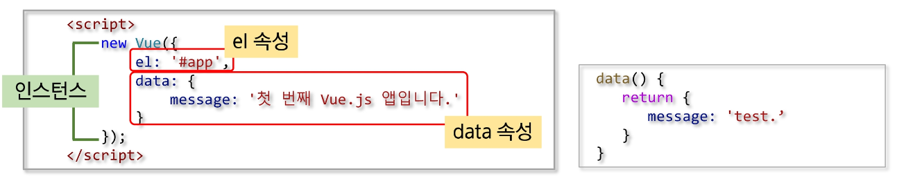

## Vue.js

### Vue.js

##### 개요

- Evan You에 의해서 만들어짐
- Vue 탄생은 Google에서 Angular로 개발하다가 가벼운 걸 만들어 보고 싶은 생각으로 시작한 **개인 프로젝트**
- 사용자 인터페이스를 만들기 위해 사용하는 오픈소스 Progressive Framework

##### 특징

- 접근성 (Approachable)
- 유연성 (Versatile)
- 고성능 (Performant)

##### MVVM Pattern

<br>

- Model + View + ViewModel
- Mdoel
  - 순수 자바스크립트 객체
- View
  - 웹 페이지의 POM
- ViewModel
  - Vue의 역할
- 기존에는 자바스크립트로 view에 해당하는 DOM에 접근하거나 수정하기 위해 jQuery와 같은 library 이용
- Vue는 view와 Model을 연결하고 자동으로 바인딩하므로 양방향 통신을 가능하게 함

##### Vue.js 3.x

- 22년 3월 출시
- 컴포지션 API 출시

#### Vue Instance

##### Vue Instance 생성

<br>

- el
  - Vue가 적용될 요소 지정
  - CSS Selector or HTML Element
- data
  - Vue에서 사용되는 정보 저장
  - 객체 또는 함수의 형태
- template
  - 화면에 표시할 HTML, CSS 등의 마크업 요소를 정의하는 속성
  - 마우스 클릭 이벤트 처리와 같이 화면의 전반적인 이벤트와 화면 동작과 관련된 로직을 추가
- created
  - 뷰 인스턴스가 생성되자 마자 실행할 로직 정의

##### Vue Instance의 유효범위

- Vue Instance를 생성하면 HTML의 특정 범위 안에서만 옵션 속성들이 적용
- el 속성과 밀접한 관계가 있다
- 유효 범위 예시
  - Vue()로 인스턴스가 생성
    - el 속성에 지정한 화면 요소에 인스턴스가 부착
      - data 속성이 el 속성에 지정한 요소와 그 이하 레벨의 요소에 적용

##### Vue Instance Life Cycle

- Life Cycle은 크게 나누면 생성, 부착, 갱신, 소멸 총 4단계
- 속성
  - beforeCreate
    - Vue Instance가 생성되고 각 정보의 설정 전에 호출
    - DOM과 같은 화면 요소에 접근 불가
  - created
    - Vue Instance가 생성된 후 데이터들의 설정이 완료된 후 호출
    - Instance가 화면에 부착하기 전이기 때문에 template 속성에 정의된 DOM 요소는 접근 불가
    - 서버에 데이터를 요청하여 받아오는 로직을 수행하기 좋다
  - beforeMount
    - 마운트가 시작되기 전에 호출
  - mounted
    - 지정된 element에 Vue Instance 데이터가 마운트 된 후에 호출
    - template 속성에 정의한 화면 요소에 접근할 수 있어 화면 요소를 제어하는 로직 수행
  - beforeUpdate
    - 데이터가 변경될 때 virtual DOM이 렌더링, 패치 되기 전에 호출
  - updated
    - Vue에서 관리하는 데이터가 변경되어 DOM이 업데이트 된 상태
    - 데이터 변경 후 화면 요소 제어와 관련된 로직을 추가
  - beforeDestroy
    - Vue Instance가 제거되기 전에 호출
  - destroyed
    - Vue Instance가 제거된 후에 호출

#### 보간법(Interpolation)

##### 문자열

- 데이터 바인딩의 가장 기본 형태는 "Mustache(콧수염)" 구문(이중 중괄호)을 사용한 텍스트 보간
  - `{{속성명}}`
- v-once 디렉티브를 사용하여 데이터 변경 시 업데이트 되지 않는 일회성 보간을 수행

```html
<span>메세지 : {{ msg }}</span>

<span v-once> 다시는 변경하지 않습니다 : {{ msg }}</span>
```

##### 원시 HTML

- 이중 중괄호는 HTML이 아닌 일반 텍스트로 데이터를 해석
- 실제 HTML을 출력하려면 v-html 디렉티브를 사용

```html
<p>Using mustaches: {{rawHtml}}</p>

<p>Using v-html directive: <span v-html="rawHtml"></span></p>
```

##### JavaScript 표현식 사용

- Vue.js는 모든 데이터 바인딩 내에서 JavaScript 표현식의 모든 기능을 지원

```html
{{ number + 1 }} {{ ok ? 'YES' : 'NO'}} {{ message.split('').reverse().join('') }}

<div v-bind:id="'list-' + id"></div>
```

- 한 가지 제한사항은 각 바인딩에 하나의 단일 표현식만 포함될 수 있으므로 아래처럼 작성하면 안됨

```html
<!-- 아래는 구문입니다, 표현식이 아닙니다. -->
{{ var a = 1}}
<!-- 조건문은 작동하지 않습니다. 삼항 연산자를 사용해야 합니다. -->
{{ if (ok) {return message } }}
```
