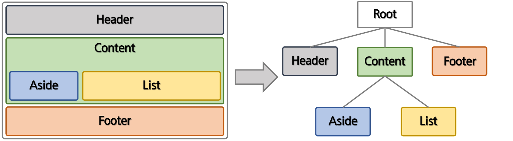

### Component

##### 컴포넌트

- Vue의 가장 강력한 기능 중 하나
- HTML Element를 확장하여 재사용 가능한 코드를 캡슐화
- Vue Component는 Vue Instance이기도 하기 때문에 모든 옵션 객체를 사용
- Life Cycle Hook 사용 가능
- 전역 컴포넌트와 지역 컴포넌트



##### 전역 컴포넌트 등록

- 전역 컴포넌트를 등록하려면, Vue.component(tageName, options)를 사용
- 권장하는 컴포넌트 이름 : 케밥 표시법(전부 소문자, -)

```html
<div id="app1">
  <my-global></my-global>
  <my-global></my-global>
</div>
<div id="app2">
  <my-global></my-global>
  <my-global></my-global>
</div>
<script>
  // 전역 컴포넌트 설정
  Vue.component("my-global", {
    template: "<div><h2>전역 컴포넌트임</h2><h3>안녕하세요</h3></div>",
  });

  new Vue({
    el: "#app1",
  });
  new Vue({
    el: "#app2",
  });
</script>
```

##### 지역 컴포넌트 등록

- 컴포넌트를 components 인스턴스 옵션으로 등록함으로써 다른 인스턴스/컴포넌트의 범위에서만 사용할 수 있는 컴포넌트를 만들 수 있다

```html
<div id="app1">
  <my-local></my-local>
  <my-local></my-local>
</div>
<div id="app2">
  <my-local></my-local>
  <my-local></my-local>
</div>
<script>
  new Vue({
    el: "#app1",
    // 지역 컴포넌트 설정
    components: {
      "my-local": {
        template: "<h2>지역 컴포넌트 입니다.</h2>",
      },
    },
  });
  new Vue({
    el: "#app2",
  });
</script>
```

##### Component Template

```html
<div id="app">
  <my-comp></my-comp>
</div>
<!-- template 설정 -->
<template id="mycomp">
  <div>
    <h2>{{msg}}</h2>
  </div>
</template>
<script>
  Vue.component("my-comp", {
    template: "#mycomp",
    data() {
      return {
        msg: "hello component",
      };
    },
  });

  new Vue({
    el: "#app",
  });
</script>
```

##### Component data 공유

```html
<h2>컴포넌트 데이터 공유</h2>
<div id="app">
  <count-view></count-view>
  <count-view></count-view>
  <count-view></count-view>
</div>
<template id="countview">
  <div>
    <span>{{ count }}</span>
    <button @click="count++">클릭</button>
  </div>
</template>
<script>
  Vue.component("count-view", {
    template: "#countview",
    data() {
      return {
        count: 0,
      };
    },
  });
  new Vue({
    el: "#app",
  });
</script>
```
