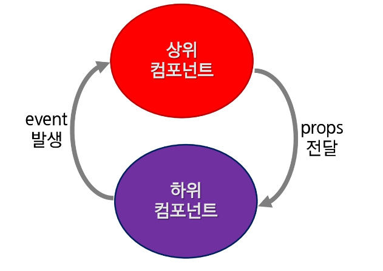

### 컴포넌트간 통신

- 단방향 통신
- 상위(부모) - 하위(자식) 컴포넌트 간의 data 전달 방법
- 부모에서 자식 : props라는 특별한 속성을 전달 (Pass Props)
  - props
- 자식에서 부모 : event로만 전달 가능 (Emit Event)
  - $emit



##### 상위에서 하위 컴포넌트로 data 전달

- 하위 컴포넌트는 상위 컴포넌트의 값을 직접 참조 불가능
- data와 마찬가지로 props 속성의 값을 template에서 사용이 가능

##### props

```html
<div id="app">
  <h2>props test</h2>
  <!-- <child-component props-data="안녕하세요"></child-component> -->
  <child-component :props-data="msg"></child-component>
</div>
<script>
  //하위 컴포넌트
  Vue.component("child-component", {
    props: ["propsData"],
    template: "<span>{{propsData}}</span>",
  });
  new Vue({
    el: "#app",
    data() {
      return {
        msg: "",
      };
    },
    created() {
      this.msg = "서버에서 얻어온 데이터 입니다.";
    },
  });
</script>
```

##### 렌더링 과정

1. new Vue()로 상위 컴포넌트인 인스턴스를 하나 생성
2. Vue.component()를 이용하여 하위 컴포넌트인 child-component를 생성
3. `<div id = "app">` 내부에 `<child-component>`가 있기 때문에 하위 컴포넌트가 된다. 처음 생성한 인스턴스 객체가 #app의 요소를 가지기 때문에 부모와 자식 관계가 성립한다
4. 하위 컴포넌트에 props 속성을 정의한다. `props: ['propsdata']`
5. html에 컴포넌트 태그(child-component)를 추가한다.
6. 하위 컴포넌트에 v-bind 속성을 사용하면 상위 컴포넌트의 data의 key에 접근이 가능하다 (message)
7. 상위 컴포넌트의 message 속성 값인 String 값이 하위 컴포넌트의 propsdata로 전달된다
8. 하위 컴포넌트의 template 속성에 정의된 `<span>{{propsdata}}</span>`에게 전달된다.

##### 동적 props

```html
<div id="app">
  <child-comp area="부울경" v-bind:msg="msg[parseInt(Math.random() * 5)]"></child-comp>
  <child-comp area="광주" v-bind:msg="msg[parseInt(Math.random() * 5)]"></child-comp>
  <child-comp area="구미" v-bind:msg="msg[parseInt(Math.random() * 5)]"></child-comp>
  <child-comp area="대전" v-bind:msg="msg[parseInt(Math.random() * 5)]"></child-comp>
  <child-comp area="서울" v-bind:msg="msg[parseInt(Math.random() * 5)]"></child-comp>
</div>
<template id="ChildComp">
  <div>
    <h2>SSAFY {{area}}지역 8기 {{msg}}</h2>
  </div>
</template>
<script>
  Vue.component("child-comp", {
    props: ["area", "msg"],
    template: "#ChildComp",
  });
  new Vue({
    el: "#app",
    data: {
      msg: ["굿^^", "최고!!", "실화냐?", "좋아요*", "짱!!"],
    },
  });
</script>
```

```html
<div id="app">
  <child-comp
    v-for="(area, i) in areas"
    :key="i"
    :area="area"
    v-bind:msg="msg[parseInt(Math.random() * 5)]"
  >
  </child-comp>
</div>
<template id="childcomp">
  <div>
    <h2>SSAFY {{area}}지역 8기 {{msg}}</h2>
  </div>
</template>
<script>
  Vue.component("child-comp", {
    props: {
      area: String,
      msg: {
        type: String,
        require: true,
      },
    },
    template: "#childcomp",
  });
  new Vue({
    el: "#app",
    data: {
      areas: ["부울경", "광주", "구미", "대전", "서울"],
      msg: ["굿^^", "최고!!", "실화냐?", "좋아요*", "짱!!"],
    },
  });
</script>
```

##### 객체의 속성 전달 props

- 오브젝트의 모든 속성을 전달 할 경우, v-bind:prop-name 대신 v-bind만 작성함으로써 모든 속성을 prop으로 전달할 수 있다.

```html
<h2>컴포넌트 객체 데이터 전달</h2>
<div id="app">
  <h3>사용자 정보</h3>
  <member-view :member="user"> </member-view>
</div>
<template id="MemberView">
  <div>
    <div>이름 : {{member.name}}</div>
    <div>나이 : {{member.age}}</div>
    <div>이메일 : {{member.email}}</div>
  </div>
</template>

<script>
  Vue.component("member-view", {
    props: ["member"],
    template: "#MemberView",
  });
  new Vue({
    el: "#app",
    data() {
      return {
        user: {
          name: "홍길동",
          age: 22,
          email: "hong@ssafy.com",
        },
      };
    },
  });
</script>
```

##### 사용자 정의 이벤트

- 이벤트 이름
  - 컴포넌트 및 props와는 달리, 이벤트는 자동 대소문자 변환을 제공하지 않는다
  - 대소문자를 혼용하는 대신에 emit할 정확한 이벤트 이름을 작성하는 것을 권장
  - v-on 이벤트 리스너는 항상 자동으로 소문자로 변환되기 때문에 v-on:myEvent는 자동으로 v-on:myevent로 변환된다.
  - 이러한 이유 때문에, 이벤트 이름에는 케밥 표기법을 사용하는 것이 권장된다.

```html
<!-- 이벤트 발생 -->
vm.$emit("이벤트명". [... 파라미터]); vm.$emit("speed", 100);

<!-- 이벤트 수신 -->
vm.$on("이벤트명", 콜백함수(){});
```

```html
<h2>사용자 정의 이벤트</h2>
<div id="app">
  <button v-on:click="doAction">메세지전송</button>
  <h2>{{message}}</h2>
</div>
<script>
  new Vue({
    el: "#app",
    data: {
      message: "",
    },
    methods: {
      doAction() {
        this.$emit("sendMsg", "안녕하세요 여러분");
      },
    },
    created() {
      this.$on("sendMsg", (msg) => {
        alert(msg);
        this.message = msg;
      });
    },
  });
</script>
```

##### 하위에서 상위 컴포넌트로 event 전달

- 하위 컴포넌트에서 상위 컴포넌트가 지정한 이벤트를 발생 ($emit)
- 상위 컴포넌트는 하위 컴포넌트가 발생한 이벤트를 수신 (on)하여 data 처리

```html
<div id="app">
  <h4>당신이 좋아하는 파트를 선택하세요</h4>
  <h2>총 투표수 : {{ total }}</h2>
  <subject v-on:add-total-count="addTotalCount" title="코딩"></subject>
  <subject v-on:add-total-count="addTotalCount" title="알고리즘"></subject>
</div>
<script>
  Vue.component("subject", {
    template: '<button v-on:click="addCount">{{title}} - {{ count }}</button>',
    //props 설정
    props: ["title"],
    data: function () {
      return {
        count: 0,
      };
    },
    methods: {
      addCount: function () {
        this.count += 1;
        // 부모 v-on:이름 에 해당하는 이름의 이벤트를 호출
        this.$emit("add-total-count");
      },
    },
  });

  new Vue({
    el: "#app",
    data: {
      total: 0,
    },
    methods: {
      addTotalCount: function () {
        this.total += 1;
      },
    },
  });
</script>
```
