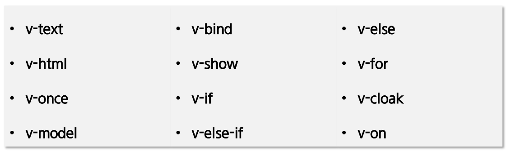

### 디렉티브(Directive)

- 디렉티브는 v- 접두사가 있는 특수 속성
- 디렉티브 속성 값은 단일 JavaScript 표현식이 된다. (v-for는 예외)
- 디렉티브의 역할은 표현식의 값이 변경될 때 사이드 이펙트를 반응적으로 DOM에 적용



##### v-model

- 양방향 바인딩 처리를 위해서 사용(form의 input, textarea)

```html
<div id="app">
    <input type="text" v-model="msg" />
    <div>{{msg}}</div>
</div>
<script>
    let app = new Vue({
        el: "#app",
        data: {
            msg: "Hello Vue~!",
        },
    });
</script>
```

##### v-bind

- 엘리먼트 속성과 바인딩 처리를 위해서 사용
- v-bind는 약어로 ":"로 사용 가능

```html
<div id="app">
<!-- 속성을 바인딩 합니다. -->
    <div v-bind:id="idValue">v-bind 지정 연습</div>
    <button v-bind:[key]="btnId">버튼</button>

    <!-- 약어를 이용한 바인딩. -->
    <div :id="idValue">v-bind 지정 연습</div>
    <button :[key]="btnId">버튼</button><br />
</div>
<script>
    new Vue({
        el: "#app",
        data: {
            idValue: "test",
            key: "id",
            btnId: "btn1",
        },
    });
</script>
```

##### v-show

- 조건에 따라 엘리먼트를 화면에 렌더링
- style의 display를 변경

```html
<div id="app">
    <div v-show="isShow">{{msg}}</div>
</div>
<script>
    new Vue({
        el: "#app",
        data: {
            isShow: true,
            msg: "보이나요?",
        },
    });
</script>
```

##### v-if, v-else-if, v-else

- 조건에 따라 엘리먼트를 화면에 렌더링

```html
<div id="app">
    <div>
        <span>나이 : </span>
        <input type="number" v-model="age" />
    </div>
    <div>
        요금 :
        <span v-if="age < 10">무료</span>
        <span v-else-if="age < 20">7000원</span>
        <span v-else-if="age < 65">10000원</span>
        <span v-else>3000원</span>
    </div>
</div>
<script>
    const vm = new Vue({
        el: "#app",
        data: {
            age: "0",
        },
    });
</script>
```

##### v-show VS v-if의 차이점

||v-if|v-show|
|--|--|--|
|렌더링|false일 경우 X| 항상 O|
|false 일 경우|엘리먼트 삭제|display:none 적용|
|template 지원|O|X|
|v-else 지원|O|X|

##### v-for

- 배열이나 객체의 반복에 사용
  - v-for="요소변수이름 in 배열" 
  - v-for="(요소변수이름, 인덱스) in 배열"

```html
<!-- 범위 반복문, 배열 반복문 처리 -->
<h2>v-for</h2>
<div id="app">
    <h2>범위지정(4)</h2>
    <span v-for="i in 4"> {{i}} </span>

    <h2>문자열 배열</h2>
    <ul>
    <li v-for="name in regions">{{name}}</li>
    </ul>

    <h2>문자열 배열 - 위치</h2>
    <ul>
    <li v-for="(name, i) in regions">번호 : {{i}}, 지역 : {{name}}</li>
    </ul>
</div>
<script>
    new Vue({
    el: "#app",
    data: {
        regions: ["광주", "구미", "대전", "서울", "부울경"],
    },
    });
</script>
```

##### template

- 여러 개의 태그들을 묶어서 처리해야 할 경우 template를 사용
- v-if, v-for, component등과 함께 많이 사용

```html
<template v-if="count % 2 == 0">
    <h4>여러개의 태그를 묶어서 처리해야 한다면??</h4>
    <h4>template 태그를 사용해 보자</h4>
    <h4>만약에 template가 없다면?? 각태그마다 v-if?</h4>
</template>
<template v-for="(region, index) in ssafy" v-if="region.count === count">
    <h3>지역 : {{region.name}} ({{region.count}}개반)</h3>
</template>
```

##### v-cloak

- Vue Instance가 준비될 때까지 mustache 바인딩을 숨기는데 사용
- [v-cloak]{display:none}과 같은 CSS 규칙과 함께 사용
- Vue Instance가 준비되면 v-cloak은 제거됨

```html
<style>
    [v-cloak]::before {
        content: '로딩중...'
    }
    [v-cloak] > * {
        display: none;
    }
</style>
...
<h2>v-cloak</h2>
<div id="app">
    <h1>1 일반. - {{msg}}</h1>
    <div v-cloak>
        <h1>2 v-cloak. - {{msg}}</h1>
    </div>
</div>
<script>
    setTimeout(function () {
        new Vue({
            el: "#app",
            data: {
                msg: "hello"
            }
        })
    }, 3000);
</script>
```