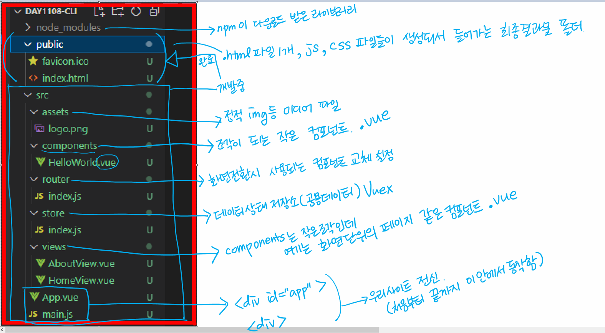

### Vue CLI(Command Line Interface)

##### 실행 환경 구축

- [NodeJS 설치](https://nodejs.org/ko/) - LTS 버전
- NPM을 이용한 @vue/cli 설치
  - NPM
    - Node Package Manager
    - Command에서 써드파티 모듈을 설치하고 관리하는 툴
    - [모듈 검색](http://www.npmjs.com/)
  - NPM 명령어
    - npm init
      - 새로운 프로젝트나 패키지를 만들 때 사용
    - npm install package
      - 생성되는 위치에서만 사용 가능한 패키지 설치
    - npn install -g package
      - 글로벌 패키지에 추가. 모든 프로젝트에서 사용 가능한 패키지로 설치

##### @vue/cli

- Vue.js 개발을 위한 시스템으로 Vue.js에서 공식으로 제공하는 CLI
- 개발의 필수는 아니지만 개발의 편리성을 위해 필수처럼 사용
- Vue 프로젝트를 빠르게 구성할 수 있는 스캐폴딩을 제공
- Vue와 관련된 오픈 소스들의 대부분이 CLI를 통해 구성이 가능하도록 구현되어 있음
- https://cli.vuejs.org/

##### @vue/cli 프로젝트 생성

```
vue create [project-name]
```

- 생성 중 중지 : ctrl+c

##### 프로젝트 생성 이후 별도 플러그인 설치

```
vue add [plugin-name]
```

##### axios 추가

```
npm install axios
```

- 설치가 제대로 되었는지 설치 이후 package.json 파일의 dependencies 확인

##### 생성된 vue-board 프로젝트 실행

```
cd [생성된 프로젝트 폴더]
npm run serve
```

### SFC

##### SFC(Single File Component)

- 확장자가 .vue 인 파일
- .vue = template(html) + script + style
- 구문 강조가 가능
- 컴포넌트에만 CSS의 범위를 제한 할 수 있음
- 전처리기를 사용해 기능의 확장이 가능
  <br>
- `<template>`
  - 기본 언어 : html
  - 각 \*.vue 파일은 한번에 최대 하나의 `<template>` 블록을 포함할 수 있다.
  - 내용은 문자열로 추출되어 컴파일 된 Vue Component의 template 옵션으로 사용
- `<script>`
  - 기본 언어 : js
  - 각 \*.vue 파일은 한번에 최대 하나의 `<script>` 블록을 포함 할 수 있다.
  - ES2015(ES6)를 지원하여 import와 export를 사용할 수 있음
- `<style>`
  - 각 \*.vue 파일은 여러 개의 `<style>` 태그를 지원
  - scoped 속성을 이용하여 현재 컴포넌트에서만 사용 가능한 css를 지정 가능

##### 구조


