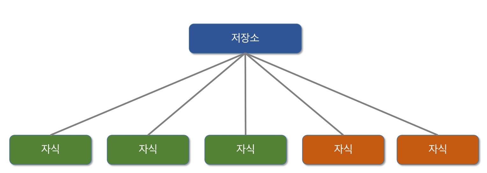

### vuex

- Vue.js application에 대한 상태관리패턴 + 라이브러리
- application 모든 component들의 중앙 저장소 역할
- 상위(부모) 하위(자식)의 단계가 많이 복잡해 진다면 데이터의 전달하는 부분이 매우 복잡해 짐
- applicaiton이 여러 구성 요소로 구성되고 더 커지는 경우 데이터를 공유하는 문제가 발생

##### 상태 관리 패턴

- 상태는 앱을 작동하는 원본 소스 (= data)
- 뷰는 상태의 선언적 매핑 (= template)
- 액션은 뷰에서 사용자 입력에 대해 반응적으로 상태를 바꾸는 방법 (= method)

##### vuex의 핵심 컨셉

##### vuex 구성요소 - state

- vuex는 Single State Tree(단일 상태 트리)를 사용
- 중앙에서 관리하는 모든 상태 정보를 state가 관리
- 여러 컴포넌트 내부에 있는 특정 state를 중앙에서 관리함
  - vuex 이전은 state를 찾기 위해 각 컴포넌트들을 직접 확인
  - vuex를 활용하면 vuex Store에서 컴포넌트에서 사용하는 state를 한 눈에 파악 가능
- mutations에 정의된 method에 의해 변경
- state가 변경되면 해당 state를 공유하는 모든 컴포넌트의 DOM은 자동으로 렌더링 됨
- 모든 Vue 컴포넌트는 Vuex Store에서 state 정보를 가져와 사용
- 각 컴포넌트는 dispatch()를 사용하여 actions 내부의 method를 호출

##### vuex 구성요소 - actions

- 컴포넌트에서 dispatch() method에 의해 호출 됨
- BackEnd API와 통신하여 Data Fetching등의 작업을 수행함
  - 동기적 작업 뿐만 아니라 비동기 작업을 포함
- 항상 context가 인자로 넘어옴
  - store.js 파일 내에 있는 모든 요소의 변경 및 호출 가능
  - 가능은 하지만 state를 직접 변경하는 것은 권장하지 않음
- mutations에 정의되어 있는 method를 commit method를 이용하여 호출
- state는 반드시 mutations가 가진 method를 통해서만 조작 함
  - 서비스 규모가 커지더라도 state 관리를 올바르게 하기 위함

##### vuex 구성요소 - mutations

- actions에서 commit() method에 의해 호출 됨
- actions에서는 비동기적 작업을 mutations에서는 동기적 작업만을 함
  - 비동기적 작업이 있을 경우 state의 변화 시점이 명확하지 않을 수 있기 때문임
- mutations에 정의하는 method의 첫 번째 인자에는 state가 넘어옴

##### vuex 구성요소 - getters

- computed와 유사
- state를 변경하지 않고 활용하여

### 언제 사용해야 하나요?

#### 대규모 SPA에서는 써야하지만 대규모 SPA가 아니라면 효율적이지 않다
